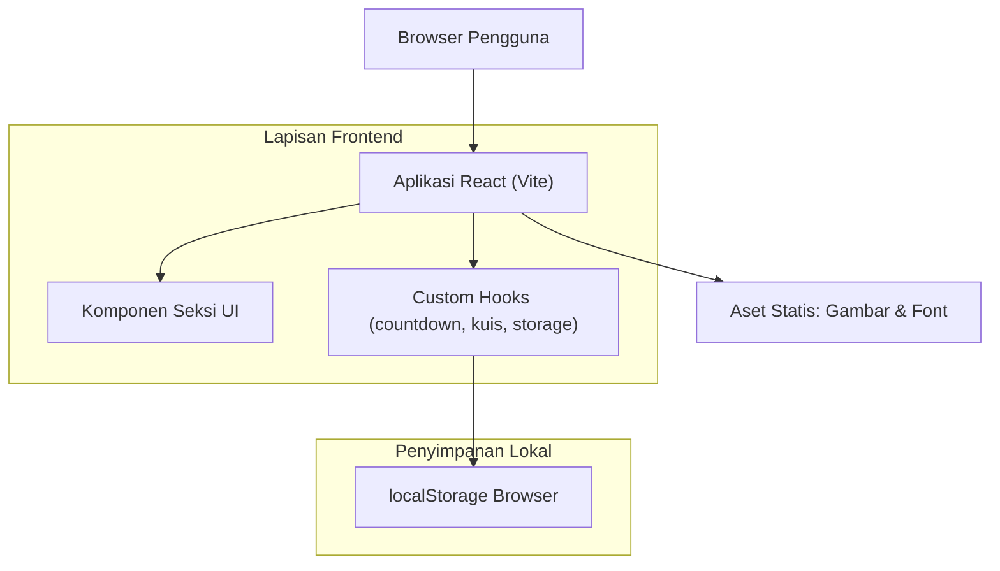

# Arsitektur Teknis — Website Hari Pacar Sedunia

## 1. Desain Arsitektur



## 2. Deskripsi Teknologi
- Frontend: React@18 + TypeScript + tailwindcss@3 + vite
- Tool inisialisasi: vite (template react-ts)
- Animasi: CSS animations + Intersection Observer untuk scroll reveal; canvas ringan buatan sendiri untuk konfeti (tanpa dependensi berat)
- Backend: Tidak ada (fully static, bisa di-deploy ke hosting statis)
- Database: Tidak ada. Kustomisasi (nama pasangan, alasan tambahan, hasil kuis) disimpan di `localStorage`
- Font: Fraunces + Plus Jakarta Sans via Google Fonts
- Gambar: dihasilkan via endpoint text_to_image

## 3. Definisi Rute
| Rute | Tujuan |
|---|---|
| / | Halaman tunggal berisi seluruh seksi (hero, alasan, kuis, galeri, pesan, penutup). Navigasi antar seksi memakai anchor scroll. |

## 4. Definisi API
Tidak ada backend/API. Seluruh state dikelola di sisi klien.

## 5. Model Data (localStorage)

```typescript
type AppState = {
  partnerName: string;           // nama pasangan di hero
  customReasons: Reason[];       // alasan tambahan dari pengguna
  quizBestScore: number;         // skor terbaik kuis
  customCard: GreetingCard | null; // kartu ucapan custom terakhir
};

type Reason = {
  id: string;
  emoji: string;
  title: string;
  body: string;
};

type GreetingCard = {
  from: string;
  to: string;
  message: string;
};
```

Kunci localStorage: `haripacar:state` (JSON string dari `AppState`).

## 6. Struktur Berkas
```
src/
  App.tsx
  main.tsx
  index.css
  data/content.ts          // teks alasan, soal kuis, galeri, surat
  hooks/useCountdown.ts
  hooks/useLocalState.ts
  hooks/useReveal.ts
  components/TopBanner.tsx
  components/Hero.tsx
  components/Countdown.tsx
  components/Reasons.tsx
  components/Quiz.tsx
  components/Gallery.tsx
  components/Letters.tsx
  components/FinalCTA.tsx
  components/Footer.tsx
  components/FloatingHearts.tsx
  components/Confetti.tsx
  components/Modal.tsx
```
