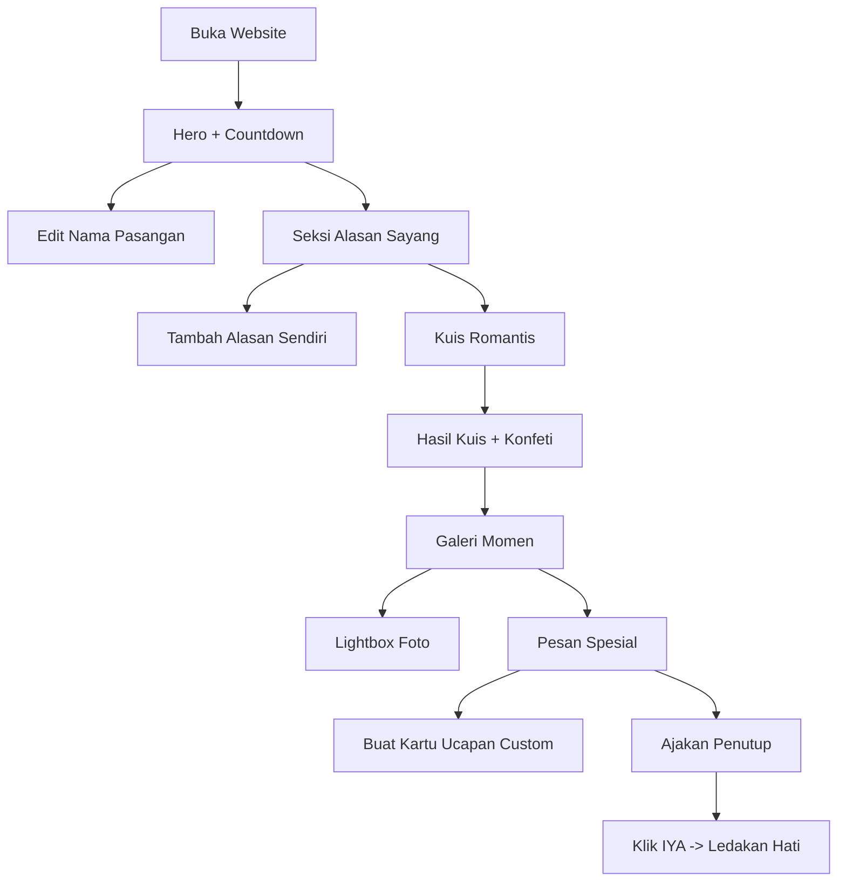

# PRD — Website Interaktif Hari Pacar Sedunia

## 1. Ringkasan Produk
Website single-page interaktif berisi dedikasi romantis untuk Hari Pacar Sedunia (World Girlfriend's Day), lengkap dengan countdown, kuis, galeri momen, dan surat digital.
- Tujuan: memberi cara personal, manis, dan menyenangkan untuk mengekspresikan rasa sayang ke pasangan lewat pengalaman web yang bisa dimainkan bersama.
- Nilai: bisa dibagikan lewat link, dikustomisasi nama & pesan, dan menghasilkan momen "aww" yang berkesan.

## 2. Fitur Inti

### 2.1 Peran Pengguna
Tidak ada sistem login. Semua pengunjung memiliki akses yang sama (mode tamu). Data kustomisasi disimpan di localStorage browser.

### 2.2 Modul Fitur
Website terdiri dari 1 halaman utama (single page) dengan 7 seksi interaktif:
1. **Hero + Countdown**: judul dedikasi, nama pasangan yang bisa diedit, hitung mundur real-time ke Hari Pacar Sedunia (1 Agustus).
2. **Alasan Aku Sayang Kamu**: grid kartu alasan yang bisa dibuka satu per satu, plus tombol tambah alasan sendiri.
3. **Kuis Romantis**: kuis 5 pertanyaan dengan skor dan hasil akhir bertema level keromantisan.
4. **Galeri Momen**: kartu polaroid momen yang bisa di-hover/klik untuk membesar (lightbox).
5. **Surat & Pesan Spesial**: kartu surat yang bisa dibuka (flip/expand) dan generator kartu ucapan custom.
6. **Ajakan Penutup**: pertanyaan "Mau jadi pacarku selamanya?" dengan tombol "Nggak" yang kabur dari kursor.
7. **Efek Global**: hujan hati, konfeti, musik latar toggle, kursor kustom.

### 2.3 Detail Halaman
| Nama Halaman | Nama Modul | Deskripsi Fitur |
|---|---|---|
| Beranda | Banner atas | Pita tipis dengan teks "Selamat Hari Pacar Sedunia" dan animasi berjalan. |
| Beranda | Hero + Countdown | Judul besar dua warna, nama pasangan bisa diklik untuk diedit (tersimpan di localStorage), sub-teks deskripsi, kartu countdown 4 kolom (hari/jam/menit/detik) yang update tiap detik. |
| Beranda | Alasan Sayang | Grid 7+ kartu alasan. Klik "Baca alasan ini" untuk expand isi kartu dengan animasi. Tombol "Tambah alasan versi kamu" membuka form untuk menambah kartu baru (tersimpan lokal). Hati kecil di tiap kartu berdetak saat hover. |
| Beranda | Kuis Romantis | 5 pertanyaan pilihan ganda, progress bar, skor bertambah, hasil akhir dengan judul level + konfeti, tombol ulangi kuis. |
| Beranda | Galeri Momen | 4+ kartu polaroid miring acak dengan caption dan tanggal. Klik untuk membuka lightbox gambar besar. Hover memberi efek angkat & lurus. |
| Beranda | Pesan Spesial | 2 kartu surat panjang yang bisa di-expand. Tombol "Buat kartu ucapan custom" membuka modal: input nama pengirim, nama penerima, pesan → menghasilkan kartu preview yang bisa disalin sebagai teks / dibagikan lewat link. |
| Beranda | Ajakan Penutup | Panel gradien besar dengan pertanyaan, tombol "IYA, MAU BANGET!" (memicu ledakan hati + konfeti) dan tombol "Nggak" yang berpindah posisi acak saat didekati kursor. |
| Beranda | Footer | Teks kecil "Made with love for World Girlfriend's Day" + tahun. |
| Beranda | Kontrol Global | Toggle musik latar di pojok kanan atas, hujan hati di latar belakang, tombol scroll-to-top. |

## 3. Alur Utama
Pengguna membuka website → melihat hero dan countdown → mengganti nama pasangan (opsional) → scroll membaca alasan-alasan → memainkan kuis romantis dan melihat skor → melihat galeri momen → membaca surat spesial dan membuat kartu ucapan custom → sampai di ajakan penutup dan menekan "IYA" → konfeti dan pesan penutup muncul.

## 4. Desain Antarmuka

### 4.1 Gaya Desain
- Warna utama: pink fuchsia (#FF3D8B) dan magenta gelap (#C2185B); aksen ungu (#8B5CF6) dan oranye lembut (#FF8A65).
- Latar: krem-pink sangat muda (#FDF2F6) dengan gradien mesh lembut, tekstur noise halus, dan hati mengambang.
- Tombol: pill fully-rounded dengan gradien pink→ungu, shadow lembut berwarna, efek angkat saat hover.
- Font: display "Fraunces" (serif ekspresif) untuk judul, "Plus Jakarta Sans" untuk body — hindari font generik.
- Layout: berbasis kartu putih dengan sudut besar (radius 20-28px), border tipis pink, shadow lembut, konten terpusat maksimum 1100px.
- Ikon/emoji: hati (💖 💗 💜), bunga (🌸), bintang (✨) digunakan hemat sebagai aksen.

### 4.2 Ringkasan Desain per Modul
| Nama Halaman | Nama Modul | Elemen UI |
|---|---|---|
| Beranda | Banner atas | Pita pink pucat, teks kecil uppercase tracking lebar, marquee lambat. |
| Beranda | Hero | Judul serif 56-72px dua baris, baris kedua gradien pink→ungu; nama editable dengan garis bawah putus-putus; kartu countdown putih dengan 4 angka besar. |
| Beranda | Alasan Sayang | Grid 3 kolom (desktop) / 1 kolom (mobile), kartu putih, hati kecil di kiri atas, judul semibold, teks abu, link "Baca alasan ini →" pink. Reveal bertahap saat scroll. |
| Beranda | Kuis | Kartu putih besar dengan overlay gradien pink di sudut, progress bar tipis, opsi jawaban berupa baris pill yang menyala pink saat hover/dipilih. |
| Beranda | Galeri | Polaroid putih dengan rotasi -6°..6°, caption handwriting-ish, hover meluruskan dan mengangkat kartu. |
| Beranda | Pesan Spesial | 2 kartu surat dengan garis atas gradien, teks paragraf, hati di pojok kanan atas. |
| Beranda | Penutup | Panel gradien pink→ungu full-width dengan sudut sangat bulat, teks putih besar, dua tombol; efek shimmer bergerak. |
| Beranda | Global | Kursor kustom hati (desktop), hujan hati transparan, konfeti canvas saat momen kemenangan. |

### 4.3 Responsivitas
Desktop-first dengan adaptasi mobile: grid runtuh ke 1 kolom di bawah 768px, ukuran judul mengecil dengan clamp(), kursor kustom dinonaktifkan pada perangkat sentuh, target sentuh minimal 44px, animasi dikurangi bila `prefers-reduced-motion`.
